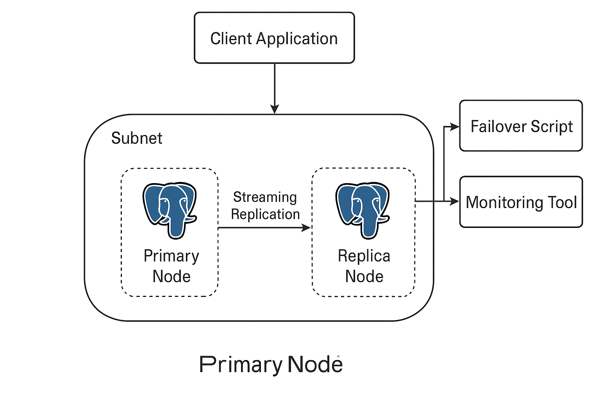

# PostgreSQL High Availability Architecture

## 📊 Architecture Diagram

This diagram represents a basic high-availability PostgreSQL setup designed for a critical application (such as a healthcare system).

---

## 🔧 Components

- **Client Application**  
  Connects to the database system and performs read/write operations. It represents a critical system such as an electronic medical record system.

- **Primary Node (PostgreSQL)**  
  The main database server that handles all write operations and serves as the source for streaming replication.

- **Replica Node (PostgreSQL)**  
  A standby database server that continuously receives updates from the primary node via streaming replication. It remains in read-only mode until failover is triggered.

- **Streaming Replication**  
  Ensures that all data changes on the primary are copied in near real-time to the replica node for high availability.

- **Failover Script**  
  A custom script or third-party tool that monitors the primary node and automatically promotes the replica in case of failure.

- **Monitoring Tool**  
  A basic monitoring system that checks replication status, server health, and alerts in case of anomalies. This could be implemented with Python or tools like Prometheus/Grafana.

---

## 🔄 Failover Process

If the primary node fails:
1. The failover script detects the issue.
2. The replica node is promoted to become the new primary.
3. Once the original primary recovers, it can be reintegrated as a replica manually.

---

## ✅ Benefits

- Minimal downtime in case of failure
- Real-time replication of data
- Simple and scalable base architecture
- Docker-compatible for simulation and testing

---

## 📌 Notes

- This is a minimal setup suitable for proof-of-concept or local testing.
- More complex setups can include multiple replicas, load balancing (e.g., HAProxy), and automated rejoin scripts.
